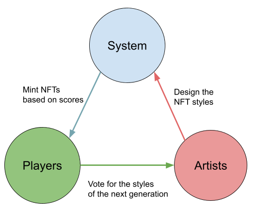
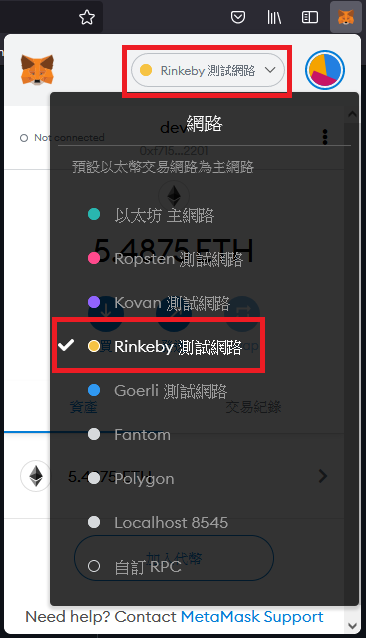
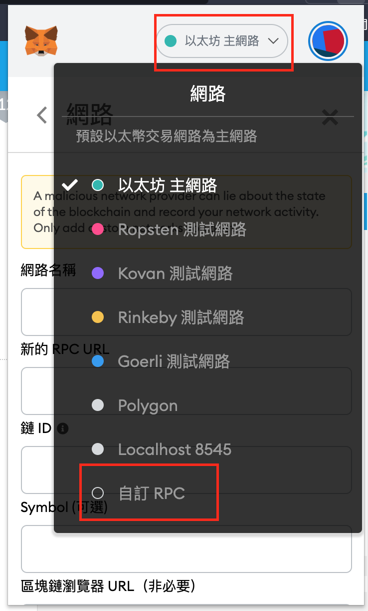
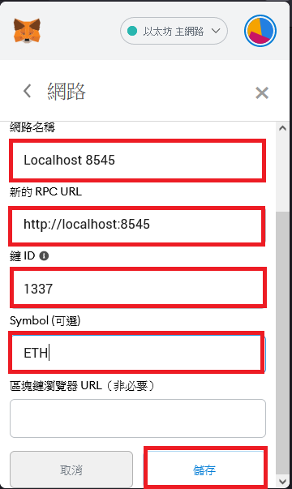
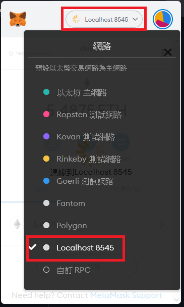

# Flora & Fauna
### An upgradable NFT game for both players and artists.  



## Overview
### Game to get NFTs
Flora & Fauna (F&F) is a game about market prediction and upgradable NFT. There are two groups of army: Flora side and Fauna side. Minions in Flora Army grow stronger when training in bullish markets, and minions in Fauna Army stronger in bearish markets. Players can recruit and train minions by predicting market prices. If a minion’s power reaches some thresholds, you can grant it a new rank with a corresponding NFT medal.
In addition, there are two kinds of enhancer to improve training, Chlorophyll for Flora minions and Hemoglobin for Fauna minions, adding some ERC20 elements in this game.

### Platform for proposals
The platform is called “battlefield” in our system, where artists propose and players fight. Players arm and send their minions to the battlefield and fight for territories as well as the right to vote. Occupying fields grants you the right to vote for NFT styles. Ranking system will update the medal styles according to the winner among proposals.

## How to start
1. Install [MetaMask](https://metamask.io/) to your browser, and create an account.  
2. Switch to Rinkeby testnet.  
      
3. Get some ETH from [faucet](https://faucet.rinkeby.io/).  
4. Here's our [website]("https://flora-fauna.netlify.app/"). Enjoy yourself!  

## How to play (for players)
1. Choose a valid [Chainlink price feed](https://docs.chain.link/docs/ethereum-addresses/), for example: ETH/USD  
2. Recruit a flora or fauna minion from this ETH/USD branch, with initial power 1000.  
3. Train the minion under market environment.  
   Flora minions become stronger in bullish market, weaker in bearish.  
   Fauna minions become stronger in bearish market, weaker in bullish.  
4. Arm the minion and update its power. Armed minions are unaffected by market price change.  
5. You can heal a minion who is suffering negative training, but it cost some extra enhancer.  
6. You can boost a armed minion to catch up training, but still it cost some extra enhancer.  
7. Liberate a minion and get some enhancer to help other allies.  
   Seems bloody and cruel? Well it's just a game, don't take it too serious >.^  
8. Send your minions to battlefield and fight for territories.  
   Occupy some fields and you will able to decide the styles of NFTs of the next generation.  

More details in [whitepaper](https://docs.google.com/document/d/1AwX-eP3bZ_XL-YBK7c2zRt0PAFiJFwo-sstIe6dzVns/edit)

## How to propose (for artists)
1. Upload all the artworks to somewhere, e.g. IPFS, and get the URIs of these artworks.
2. Warp the URIs into metadata, strictly named these metadata “flora_1.json” to “flora_5.json”, “fauna_1.json” to “fauna_5.json” and last but not least the combination of this series named “series.json”, which will be minted as NFT to the winner artist.
3. Upload all eleven JSON files to somewhere under the same directory and get the URI prefix, like this one below.
```
https://ipfs.io/ipfs/bafybeihnqjnsltio43lqwc5uowzzlfipklbxxnvy4pa7mqn6pmhieiouam/
```
4. Propose this prefix to the contract and just let it do the work.  

## How to develop (for developers)
### Installation

1. Install Ganache.
    
    ```bash
    npm install -g ganache-cli
    ```

2. Install project dependencies.
    
    ```bash
    pip3 install -r requirements.txt
    ```
   
3. Install the React client dependencies.

    ```bash
    cd client
    yarn install
    ```

4. In [MetaMask](https://metamask.io/), set MetaMask local RPC.  
  
      

### Usage (Local testnet)

1. Open the Brownie console. Starting the console launches a fresh instance in the background.

    ```bash
    $ brownie console
    Brownie v1.15.2 - Python development framework for Ethereum

    Project is the active project.

    Launching 'ganache-cli --port 8545 --gasLimit 12000000 --accounts 10 --hardfork istanbul --mnemonic hill law jazz limb penalty escape public dish stand bracket blue jar'...
    Brownie environment is ready.
    ```

2. Run the [deployment script](scripts/deploy.py) to deploy the project's smart contracts.

    ```python
    >>> run("deploy")
    ```

3. While Brownie is still running, start the React app in a different terminal.

    ```bash
    # make sure to use a different terminal, not the brownie console
    cd client
    yarn start
    ```

4. Connect Metamask to the local network. In the upper right corner, click the network dropdown menu.  
   Select `Localhost 8545` and refresh the page.

      

5. Interact with the smart contracts using the web interface or via the Brownie console.

    ```python
    # get the newest FloraArmy contract
    >>> flora = FloraArmy[-1]

    # recruit a minion at ETH/USD branch
    # 0xf599f... is the ens-namehash of "eth-usd.data.eth"
    >>> flora.recruit('0xf599f4cd075a34b92169cf57271da65a7a936c35e3f31e854447fbb3e7eb736d')
    ```

    Any changes to the contracts from the console should show on the website after a refresh.


### Usage (Rinkeby testnet)

1. Start the React app.

    ```bash
    cd client
    yarn start
    ```
    
2. Connect Metamask to the local network. In the upper right corner, click the network dropdown menu.  
   Select `Rinkeby` and refresh the page.
  
      

3. Interact with the smart contracts using the web interface.
 
